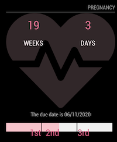

# MMM-Pregnancy
A [MagicMirror²](https://magicmirror.builders) helper module to show pregnancy information.

[](https://raw.githubusercontent.com/bibaldo/MMM-CountUP/master/LICENSE)



## Installation

In your terminal, go to your MagicMirror's Module folder:
````
cd ~/MagicMirror/modules
````

Clone this repository:
````
git clone https://github.com/bibaldo/MMM-Pregnancy.git
````

Add the module to the modules array in the `config/config.js` file:
````javascript
  {
    module: "MMM-Pregnancy"
  },
````

## Configuration options

The following properties can be configured:


| Option                       | Description
| ---------------------------- | -----------
| `header`                     | The header text <br><br> **Default value:** `'Pregnancy'`
| `date`                       | Last menstrual period (LMP) <br> **Format:** `format MM/DD/YYYY`
| `showConceptionDate`         | Show or not the conception date <br><br>**Default value:** `false`
| `USDateFormat`               | Show dates with US date format `MM/DD/YYYY` <br><br>**Default value:** `false`

## Config Example

````javascript
  {
    module: "MMM-Pregnancy",
    config: {
      header: 'Pregnancy',
      date: '12/20/2019', // format MM/DD/YYYY
      USDateFormat: false,
      showConceptionDate: true
    }
  },
````
## Updating

To update the module to the latest version, use your terminal to go to your MMM-Pregnancy module folder and type the following command:

````
git pull
```` 

Feel free to open any Issue :smiley: